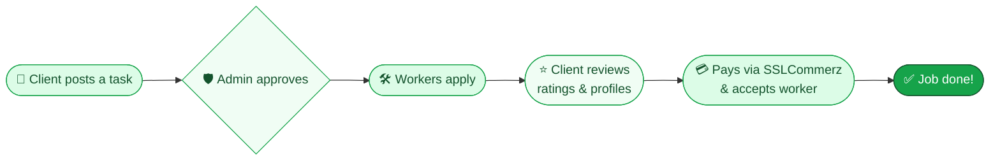

<div align="center">


# Shohojogi · সহযোগী

### *Everyone has something to offer.*

**And everyone needs a little help sometimes.**
Shohojogi connects people who need something done with people who can do it.

<br />


</div>

---

## 👥 The Team

<div align="center">

<table>
  <tr>
    <td align="center" width="220">
      <a href="https://github.com/RaiyanKhan1">
        
      </a>
      <br /><br />
      <b>Ali Musaddeq Khan Raiyan</b>
      <br />
      <sub>💚 Contributor</sub>
      <br />
      <a href="https://github.com/RaiyanKhan1"><sub>@RaiyanKhan1</sub></a>
    </td>
    <td align="center" width="220">
      <a href="https://github.com/joya-12912">
        
      </a>
      <br /><br />
      <b>Sumaiya Hoque Joya</b>
      <br />
      <sub>💚 Contributor</sub>
      <br />
      <a href="https://github.com/joya-12912"><sub>@joya-12912</sub></a>
    </td>
    <td align="center" width="220">
      <a href="https://github.com/auhmav04">
        
      </a>
      <br /><br />
      <b>Ahnaf Ul Haque</b>
      <br />
      <sub>💚 Contributor</sub>
      <br />
      <a href="https://github.com/auhmav04"><sub>@auhmav04</sub></a>
    </td>
  </tr>
</table>

</div>

---

## 🌱 What is Shohojogi?

**Shohojogi** (Bengali for *helper* or *collaborator*) is a local services marketplace that is built around **people, not just services**.

Need a plumber at 8 AM? A tutor for your little brother? A driver for the weekend? Post a task and let skilled people come to you. Have a skill of your own? Browse open work, apply, get verified, and build a reputation that speaks for itself.

> 🔧 Plumbers · ⚡ Electricians · 📚 Tutors · 🚗 Chauffeurs · 🛡️ Guards · 🔨 Repair · 👶 Childcare · and more

---

## ✨ Features

<table>
  <tr>
    <td width="50%" valign="top">

### 🙋 For Clients
- 📝 **Post tasks** describing exactly what you need
- 🔎 **Browse services** offered by skilled workers
- 📥 **Review applications** for each of your listed jobs
- ⭐ **See ratings and work history** before you hire
- 💳 **Secure payments** through **SSLCommerz** when accepting a worker

    </td>
    <td width="50%" valign="top">

### 🛠️ For Workers
- 💼 **Find work** that matches your skills
- 📨 **Apply to tasks** with a single click
- 🛍️ **Post your own services** so clients can find you
- ✅ **Get verified** to earn a trust badge
- 📊 **Track your applications** in one place

    </td>
  </tr>
  <tr>
    <td width="50%" valign="top">

### 🛡️ For Admins
- 🔐 Separate, protected **admin dashboard**
- 🪪 Review and approve **worker verifications**
- ✔️ Moderate and **approve posted tasks**

    </td>
    <td width="50%" valign="top">

### 🌍 Built Responsibly
- ♻️ **Live carbon footprint meter** that estimates the CO₂ produced by your session's network traffic
- 🔒 **Role-based access**, so each page is shown only to the roles it belongs to
- 📱 Fully **responsive**, smooth **motion** animations

    </td>
  </tr>
</table>

---

## 🔄 How It Works



---

## 🧰 Tech Stack

| Layer | Tools |
| :-- | :-- |
| **Framework** | React 19 (with the React Compiler) |
| **Build tool** | Vite 8 |
| **Styling** | Tailwind CSS 4, shadcn/ui, Base UI, `tw-animate-css` |
| **Routing** | React Router 7 |
| **Animation** | Motion |
| **Icons** | Lucide React |
| **Typography** | Geist Variable |
| **Sustainability** | `react-carbon-footprint` |
| **Payments** | SSLCommerz (through the backend API) |

---

## 🚀 Getting Started

### Prerequisites
- **Node.js** 20 or newer
- **npm**
- A running instance of the **Shohojogi backend API**

### 1. Clone the repository
```bash
git clone https://github.com/RaiyanKhan1/Shohojogi.git
cd Shohojogi/shohojogi
```

### 2. Install dependencies
```bash
npm install
```

### 3. Configure your environment
Create a `.env` file inside `shohojogi/`:
```env
VITE_API_URL=http://localhost:5000/api
```

### 4. Run it
```bash
npm run dev
```
Then open **http://localhost:5173** 🎉

### 📜 Available Scripts

| Command | Description |
| :-- | :-- |
| `npm run dev` | Start the dev server with hot reload |
| `npm run build` | Build for production into `dist/` |
| `npm run preview` | Preview the production build locally |
| `npm run lint` | Run ESLint |

---

## 🗺️ Pages at a Glance

| Route | Page | Who |
| :-- | :-- | :-- |
| `/` | Homepage | Everyone |
| `/why-shohojogi` | Why Shohojogi? | Everyone |
| `/find-work` | Browse open tasks | Everyone |
| `/collections` | Browse services | Everyone |
| `/task/:id` | Task details | Everyone |
| `/product` | Worker profile | Everyone |
| `/join` | Sign up / Log in | Guests |
| `/post-task` | Post a new task | Clients |
| `/client/applications` | Applications for my jobs | Clients |
| `/post-service` | Offer a service | Workers |
| `/worker/applications` | My applications | Workers |
| `/worker/verification` | Get verified | Workers |
| `/payment/:result` | Payment result | Clients |
| `/admin` | Admin login and dashboard | Admins |

---

## 📁 Project Structure

```
shohojogi/
├── public/                 # Static assets
├── src/
│   ├── assets/icons/       # Service category icons
│   ├── Components/
│   │   ├── Admin/          # Worker verification review
│   │   ├── JobList/        # Job listing components
│   │   ├── Product/        # Worker profile sections
│   │   ├── ServiceList/    # Service listing components
│   │   ├── TaskView/       # Task details, applicants, apply card
│   │   └── ui/             # Navbar, hero, cards, buttons, effects
│   ├── Data/               # Sample data
│   ├── lib/                # Helpers and mappers
│   ├── Pages/              # Route-level pages
│   ├── App.jsx             # Routes and role guards
│   └── main.jsx            # Entry point
├── index.html
└── vite.config.js
```

---

## 🤝 Contributing

Contributions, ideas, and bug reports are always welcome!

1. Fork the project
2. Create your feature branch: `git checkout -b feature/amazing-idea`
3. Commit your changes: `git commit -m "Add amazing idea"`
4. Push to the branch: `git push origin feature/amazing-idea`
5. Open a Pull Request 🎉

---

<div align="center">

### 💚 Made with care by

**Ali Musaddeq Khan Raiyan** · **Sumaiya Hoque Joya** · **Ahnaf Ul Haque**

<sub>If Shohojogi helped you or inspired you, consider giving it a ⭐</sub>

</div>
